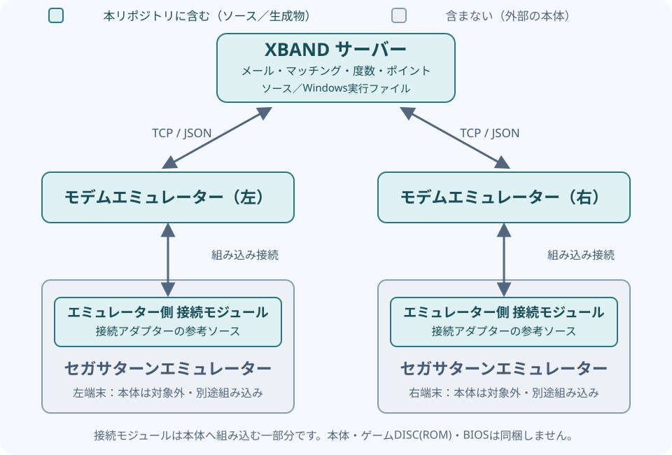

# Saturn XBAND Server / Modem Emulator



本ソフトウェアは、セガサターンのXBAND対応タイトルを、当時に近い形でプレイすることを目指したXBANDモデムエミュレーターです。別途用意するセガサターンエミュレータと接続し、付属のローカルサーバーで対戦相手のマッチングやメールなどを提供します。当時のXBANDサーバーやモデムを完全に再現するものではなく、ゲームDISC(ROM)の通信の調査・観測に基づいて、通信対戦プレイに必要な機能を再現しています。

まずは同一PC上での試験を対象にしています。XBANDでは1台のPC上でサーバーと左右2つのエミュレーターを動かし、対戦ケーブルでは同一PC上の2つのエミュレーターを直接接続して確認しています。別PC間のLAN接続やインターネット越しの対戦まで動作確認済みという意味ではありません。

図の青緑色が本リポジトリの対応範囲です。XBANDサーバー、モデムエミュレーション部品、エミュレーター側の接続モジュール（接続アダプターの参考ソース）を含みます。セガサターンエミュレーターの本体は含まず、組み込み・接続対応が別途必要です。Windows配布ZIPにはサーバー実行ファイルを含み、モデム・接続モジュールはリポジトリ内のソースとして提供します。

## バージョンごとの主な内容

### v0.3.0：ソース取り込みキットとPublic公開

v0.3.0（2026-10-09）は、GPLv3で公開する開発版です。利用者が別途取得したエミュレーターの基準ソースへSerial Port画面・対戦ケーブル・XBANDモデム・仮想サターンメディアカード設定を追加する差分と、適用・ビルドスクリプトを同梱します。エミュレーター本体・EXEは配布しません。日本語のサーバーUI、操作マニュアル、市外局番の地域対応表も含みます。まずは同一PC上での試験を対象とし、別PC間の動作試験は今後の検討事項です。

### v0.1.0：対戦・メールなどの基本機能

v0.1.0（2026-10-07／開発版v55）は、最初の開発版リリースです。対応するセガサターンエミュレーターとローカルサーバーを接続し、対戦相手の自動検索・指名、プレイヤー同士のメール、サーバーからのお知らせメールなどを利用するための基本機能をまとめました。サーバーの管理画面では、通信状況や履歴の確認、ゲーム別の勝敗ポイント・ランク、利用時間帯などを設定できます。対戦結果の記録機能も含みますが、全タイトルの実プレイや、当時のサービスと同じ動作を保証するものではありません。

### v0.2.0：仮想サターンメディアカードの度数消費

v0.2.0（2026-10-09）では、v0.1.0の基本機能に加えて、当時のプリペイドカードのように、メールや対戦の利用に応じて残り度数が減る仕組みに対応しました。カードはファイルとして保存する「仮想サターンメディアカード」です。対応するセガサターンエミュレーターのシリアルポート設定でカードファイルを指定して使用します。実際のお金を請求する機能ではありません。

度数の消費は初期状態では無効で、サーバーの設定で有効にすると動作します。標準設定では、メール接続は1度数、通常対戦は3度数を消費します。対戦途中でリセットした場合は、通常対戦の3度数の代わりに、両者とも対戦分として1度数を消費します。対戦分は各端末が次にサーバーへ接続した際に精算し、その接続のメール分1度数も加算します。通常対戦後のメール接続なら合計4度数、途中リセット後なら合計2度数です。相手側の接続を待たず、それぞれの端末で精算します。

度数の処理と料金設定は全タイトル共通です。ゲーム別に設定できるのは、料金ではなく勝敗に応じたポイントです。消費を確認できなかった場合に、同じ処理を自動で再請求したり、度数を自動で補充・返還したりはしません。詳しくは[仕様書の15章](docs/SERVER-MODEM-SPEC.md#15-全タイトル共通の度数とメディアカード)を参照してください。

## 含まれるもの

- Windows x64サーバー、Communication Monitor、アクセス・マッチング履歴。
- 自動・指名マッチング、ゲームDISC(ROM)の既存待機終了通知、共通待ち時間設定。
- 1端末4ユーザーのメール処理、センター配信メール、配信履歴。
- ゲーム別勝者・敗者ポイント、ユーザー別台帳、30ランクの設定。
- 対戦結果の生データ・照合・付与記録を保持する追記専用JSON DB。
- 使用エリア、平日・土日の利用時間帯の設定。
- モデムのレジスター、ATコマンド、UART、非同期通信、ストレージ等のC++20部品。

**セガサターンエミュレーター本体のソース一式・実行ファイル、ゲームDISC(ROM)、BIOS、セーブデータ、実際のメール・試験通信ログは含みません。** 接続アダプターと、利用者が別途取得した特定の基準ソースへSerial Port画面・対戦ケーブル・モデム接続を追加する統合差分を提供します。エミュレーター本体を配布するものではありません。[専用マニュアル](docs/YMIR-INTEGRATION-MANUAL.md)に対象版と適用・ビルド手順を記載しています。既存の通常版エミュレーターにこのサーバーを起動するだけで接続できるわけではありません。実機の電話網や旧XBANDサービスにも接続しません。

## Windows配布版

[エミュレーターへの組み込み・セットアップマニュアル](docs/YMIR-INTEGRATION-MANUAL.md)：特定のエミュレーターを使用する場合の組み込み前提、ビルド、左右の接続設定、仮想サターンメディアカードの指定を説明します。具体名は専用マニュアル内に記載しています。

v0.3.0のWindows配布には、統合差分・適用/ビルドスクリプトと外部モデム部品のソースも同梱します。以前のv0.2.0 ZIPは変更していません。エミュレーター本体や組み込み済みEXEは同梱しません。

[サーバーUI操作マニュアル](docs/SERVER-UI-MANUAL.md)：各画面の操作手順、設定の適用タイミング、度数とポイントの違い、履歴の読み方、バックアップ方法を説明します。現在のソース版では、通常UIから手動の仮想サターンメディアカード消費試験を外しています。公開済みv0.2.0 ZIPは変更していません。

確認済みゲームIDはアプリ内の標準定義としてソースに格納します。リポジトリ保存・配布時にも除去しません。設定ファイルがない初回起動でも標準ゲームリストを使用でき、保存済み設定がある場合は管理者の編集値を優先します。ゲームID定義と、除外対象の個人データ・メール・累積台帳・試験ログは別扱いです。

[GitHub Releases](https://github.com/kksszz/Saturn-xband-server-modem-emulator/releases)からWindows x64 ZIPを取得し、展開して `start-server.ps1` を実行します。初回は空の `runtime` フォルダーを作成し、台帳等をそこへ保存します。エミュレーターやゲームの起動は行いません。モデムを組み込んだ対応クライアントは別途必要です。

サーバーは既定で127.0.0.1の58240～58245を使用します（サービス2本、対戦中継2本、制御2本）。同じ番号を使う試験サーバーとは同時に起動できません。インターネット公開を想定しておらず、本番認証・TLS・不正対策は未実装です。

## ソースのビルド

Windows: Visual Studio 2022のC++ツール、CMake 3.20以上、Gitが必要です。nlohmann_json 3.12がインストールされていない場合、CMakeが公式GitHubからv3.12.0を取得します。エミュレーター本体のビルド環境は不要です。

```powershell
cmake -S . -B build -DBUILD_TESTING=ON
cmake --build build --config Release
ctest --test-dir build -C Release --output-on-failure
```

サーバー: `build/Release/xband-server.exe`。モデムのコア部分はWindows以外でもビルド可能ですが、サーバー・管理画面・ソケット実装はWindows専用です。

## 範囲と制限

旧公開ソースと共通ゲームDISC(ROM)の観測を参考にしていますが、当時の日本の本番サーバーの完全復元ではありません。ローカル追加仕様は仕様書に区別して記載しています。全タイトル共通の処理を目指し、8ゲーム×4枠の派生要求を隔離試験していますが、全ゲームの実プレイを保証しません。

メールの応答格納はゲームDISC(ROM)の受信・既読・保存完了の証明ではありません。結果DBは両端末の報告を別々に保存し、両報告の一致を確認した確定試合DBではありません。時間の格納位置・単位など未解明項目は不明のまま保存します。22で対戦後21から報告する照合は、直近の回線参加者に基づくローカル方針です。古い未送信結果を複数保持したケースの一意な帰属は保証しません。

サンプルメールはボタンで編集欄に入力するだけです。自動配信せず、管理者が確認して登録します。サンプル文面の障害は現在のサーバーの状態を示すものではありません。

仕様書: [サーバーとモデムの統合仕様書 第2版](docs/SERVER-MODEM-SPEC.md)（2026年10月9日）。6章にゲームDISC(ROM)通信コマンド一覧、5章にモデム接続用JSON一覧、8章に対戦回線用JSON一覧、15章に全タイトル共通料金・有限カード・端末別精算をまとめています。待機、メール、ポイント、結果DB、標準ゲームIDと確認範囲も統合しています。

仕様書と操作マニュアルは、当面Markdown版で提供・更新します。旧版PDFは現行リポジトリから削除し、今後の配布ZIPにも含めません。公開済みリリースの配布物は変更していません。

対戦ケーブルの別冊: [シリアル通信エミュレート仕様](docs/BATTLE-CABLE-SERIAL-SPEC.md)。SCIレジスタ、DMAと割り込み、YLS1レコード、同期と仮想遅延、再接続と保存状態を説明します。エミュレーターへの移植検証版を基準にし、当時の物理ケーブルの仕様と今回の実装仕様を区別しています。

詳しい解析記録: [XBAND-COMMAND-SPEC-DRAFT.md](docs/XBAND-COMMAND-SPEC-DRAFT.md)。この下書きには過去の実装状態も残ります。`components/xband` 内の過去の資料には開発時のパスや実験の説明が残っています。現在のリリースの起動方法はこのREADMEと同梱スクリプトを優先してください。

## 今後の開発検討事項

- 実サターンメディアカードの読み書き機能の実装。
- 別PC間での動作試験。

## 権利・依存関係

本プロジェクトは[GNU GPL version 3](LICENSE)（GPL-3.0-only）で公開します。Copyright (C) 2026 Saturn XBAND Server / Modem Emulator contributors。利用・改変・再配布・商用利用が可能です。配布時はGPLv3の条件に従い、ライセンス表示と対応するソースへのアクセスを保持してください。無保証です。Windows版に対応するソースは、各リリースの同じタグから取得できます。

XBAND/SEGA等の商標は各権利者に帰属します。Catapultの旧ソース、ゲームDISC(ROM)由来画像・アイコンは同梱せず、必要なアイコンは利用者のゲームDISC(ROM)内リソースを参照します。第三者の素材・商標・ゲーム・BIOSの利用権を与えるものではありません。nlohmann/jsonはMITライセンスで、そのほかの第三者資料は[権利・依存関係の表示](THIRD-PARTY-NOTICES.md)を参照してください。
